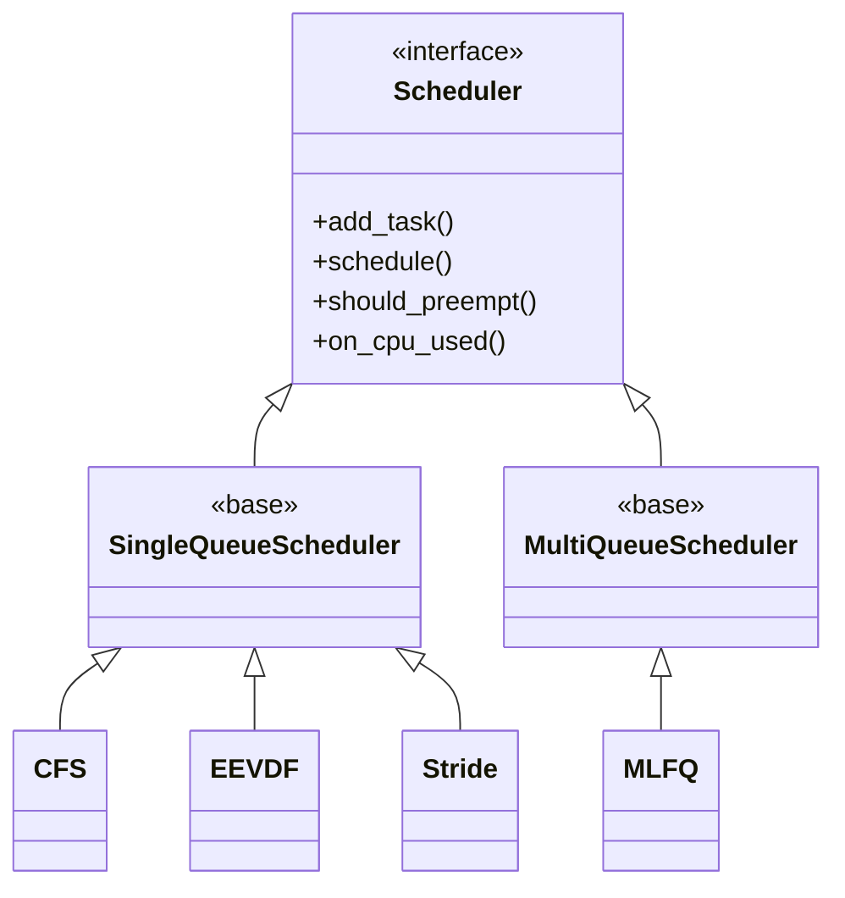

# Scheduler Simulator

A C++17 discrete-event simulator for evaluating CPU scheduling policies across single-core and multi-core configurations, including real-world trace replay.

## Features

- **4 Schedulers**: CFS, EEVDF, MLFQ, Stride
- **4 Workloads**: Server, Desktop, Google Borg V3 trace, Alibaba Cluster V2018 trace
- **3 Topologies**: SQSS, SQMS, MQMS (see diagrams below)
- **Load balancers** (MQMS): Round-Robin, Least-Loaded
- **Work stealing**: Idle cores steal from busiest queue (MQMS only)
- **Metrics**: Response time (mean, P95, P99), turnaround, throughput, Jain's fairness, context switches, preemptions
- **Run tracking**: Isolated run artifacts in `runs/<suite_id>/<run_id>/`

---

## Topology Diagrams

### Option 1 — SQSS: Single-Queue Single-Server (`-c 1 -m sq`)


One queue, one core. Simplest baseline. All schedulers run in pure single-core mode.

---

### Option 2 — SQMS: Single-Queue Multi-Server (`-c N -m sq`)


One shared queue across all cores. Cores pull the next task whenever they go idle. Higher throughput than SQSS but queue access becomes a contention point at scale.

---

### Option 3 — MQMS: Multi-Queue Multi-Server (`-c N -m mq`)


Each core has its own independent scheduler queue. A load balancer assigns arriving tasks to a core at arrival. If a core goes idle, it steals from the busiest core's queue.

---

## Scheduler Hierarchy



| Scheduler | Strategy | Key Property |
|-----------|----------|--------------|
| CFS | vruntime-based, red-black tree | Equal CPU share over time |
| EEVDF | Earliest Eligible Virtual Deadline First | Deadline-aware fairness |
| MLFQ | Multi-level feedback queue | Adapts to task behavior |
| Stride | Proportional-share via stride counters | Deterministic fairness |

---

## Build

```bash
make clean && make
```

Or with CMake:

```bash
cmake -B cmake-build -S . && cmake --build cmake-build
```

---

## Reproducible Workflow (Recommended)

This is the canonical, reproducible path to:
1. Prepare workloads
2. Run experiments
3. Run analysis
4. Generate plots

### 1) Python environment (recommended)

```bash
python3 -m venv .venv
source .venv/bin/activate
python -m pip install --upgrade pip
python -m pip install -r scripts/plot_requirements.txt
```

### 2) Build simulator

```bash
make clean && make -j4
```

Canonical binary path:

```bash
BIN=./build/bin/scheduler_sim
```

If you use CMake instead, set:

```bash
BIN=./cmake-build/bin/scheduler_sim
```

### 3) Download and prepare real-world workloads

The suite uses Google + Alibaba trace workloads. Prepare both before running the full suite.

#### Google Borg V3

1. Download Google ClusterData2019 instance events shards (`instance_events-*.json.gz`) from:
   - https://github.com/google/cluster-data/blob/master/ClusterData2019.md
2. Extract simulator CSV:

```bash
python3 real-time-workloads/google_v3/extract_google_v3.py \
  /path/to/instance_events-*.json.gz \
  -o real-time-workloads/google_v3/google_v3_workload.csv \
  -n 50000
```

#### Alibaba Cluster Trace V2018

1. Download Alibaba `batch_instance.csv` from:
   - https://github.com/alibaba/clusterdata/tree/master/cluster-trace-v2018
2. Create subset CSV at the simulator's expected path:

```bash
python3 real-time-workloads/alibaba_v2018/make_subset.py \
  --input /path/to/batch_instance.csv \
  --output real-time-workloads/alibaba_v2018/batch_instance_subset_head_40000_with_header.csv \
  --size 40000 \
  --mode head
```

Quick sanity check:

```bash
ls -lh real-time-workloads/google_v3/google_v3_workload.csv
ls -lh real-time-workloads/alibaba_v2018/batch_instance_subset_head_40000_with_header.csv
```

### 4) Run benchmark experiments (suite-driven)

Validate suite:

```bash
python3 scripts/validate_benchmark_spec.py --suite benchmark/spec/suites/community_v1.json
```

Preview commands (dry run):

```bash
python3 -m benchmark.runner.run_suite \
  --suite benchmark/spec/suites/community_v1.json \
  --bin "$BIN" \
  --dry-run
```

Run all experiments:

```bash
python3 -m benchmark.runner.run_suite \
  --suite benchmark/spec/suites/community_v1.json \
  --bin "$BIN" \
  --clean-suite-dir \
  --generate-manifests
```

### 5) Run analysis

```bash
python3 scripts/aggregate_results.py
python3 scripts/export_summary_table.py
```

Core outputs:
- `analysis/metrics_enriched.csv`
- `analysis/run_index.csv`
- `analysis/quality_checks.csv`
- `analysis/summary_table.csv`

### 6) Generate plots

Experiment plots (Exp1-Exp6):

```bash
python3 scripts/plot_experiment_suite.py \
  --analysis-dir analysis \
  --output-dir figures/experiments/community-core-exp1-exp6 \
  --formats png,pdf \
  --dpi 300 \
  --suite benchmark/spec/suites/community_v1.json
```

Optional publication-pack plots (RQ1-RQ5):

```bash
python3 scripts/plot_publication_figures.py \
  --analysis-dir analysis \
  --output-dir figures \
  --formats png,pdf \
  --dpi 300
```

Inspect generated plots:

```bash
ls -lh figures/experiments/community-core-exp1-exp6
ls -lh figures
```

Optional report pack:

```bash
python3 -m benchmark.report --suite benchmark/spec/suites/community_v1.json --format md
```

### One-command pipeline

```bash
./scripts/run_full_analysis.sh benchmark/spec/suites/community_v1.json
```

If you built with CMake and want explicit binary control, run the manual pipeline with `--bin "$BIN"`:

```bash
python3 scripts/validate_benchmark_spec.py --suite benchmark/spec/suites/community_v1.json
python3 -m benchmark.runner.run_suite --suite benchmark/spec/suites/community_v1.json --bin "$BIN" --clean-suite-dir --generate-manifests
python3 scripts/aggregate_results.py
python3 scripts/export_summary_table.py --analysis-dir analysis
python3 scripts/plot_experiment_suite.py --analysis-dir analysis --output-dir figures/experiments/community-core-exp1-exp6 --formats png,pdf --dpi 300 --suite benchmark/spec/suites/community_v1.json
```

Enable optional report pack in the wrapper:

```bash
BENCHMARK_ENABLE_REPORT=1 ./scripts/run_full_analysis.sh benchmark/spec/suites/community_v1.json
```

---

## Advanced Appendix

Use this section only if you need lower-level controls than the recommended workflow.

### Manual CLI Usage

```bash
# Run all schedulers on all workloads (SQSS, 1 core, 100 tasks)
$BIN

# SQMS: shared queue, 4 cores
$BIN -n 500 -c 4 -m sq

# MQMS: per-core queues, least-loaded balancer (default), work stealing on
$BIN -n 500 -c 4 -m mq

# MQMS: round-robin balancer
$BIN -n 500 -c 4 -m mq -b rr

# MQMS: disable work stealing
$BIN -n 500 -c 4 -m mq --no-steal

# Specific scheduler and workload
$BIN -s cfs -w server

# Google Borg V3 trace (requires prepared trace CSV)
$BIN -w google -n 1000 -c 4

# Alibaba V2018 trace (requires prepared trace CSV)
$BIN -w alibaba -n 1000 -c 4

# Multiple replications
$BIN -n 100 -c 4 -r 5
```

### Options

| Flag | Description | Default |
|------|-------------|---------|
| `-n <num>` | Number of tasks per workload | 100 |
| `-c <num>` | Number of CPU cores | 1 |
| `-r <num>` | Number of replications | 1 |
| `-t <time>` | Simulation stop time (ms) | 100000.0 |
| `-s <name>` | Scheduler: `cfs`, `eevdf`, `mlfq`, `stride`, `all` | all |
| `-w <name>` | Workload: `server`, `desktop`, `google`, `alibaba`, `all` | all |
| `-m <name>` | Topology: `sq` (single-queue), `mq` (multi-queue) | sq |
| `-b <name>` | Load balancer (mq only): `rr`, `leastloaded` | leastloaded |
| `--no-steal` | Disable work stealing (mq only) | — |
| `-h` | Show help | — |

Additional provenance flags:

| Flag | Description | Default |
|------|-------------|---------|
| `--benchmark-version <id>` | Benchmark version tag embedded in CSVs | `community-v1` |
| `--suite-id <id>` | Benchmark suite id embedded in CSVs | `ad-hoc` |
| `--run-id <id>` | Explicit run id (otherwise timestamp-based) | auto |
| `--seed <num>` | Base RNG seed | `123456789` |

---

### Artifact model

Run artifacts are isolated per case:

```
runs/<suite_id>/<run_id>/metrics.csv
runs/<suite_id>/<run_id>/tasks.csv
runs/<suite_id>/<run_id>/manifest.json
```

Canonical analysis outputs:
- `analysis/metrics_enriched.csv`
- `analysis/run_index.csv`
- `analysis/quality_checks.csv`
- `analysis/summary_table.csv`
- `analysis/summary_table.md`

### Suite + manifest utilities

Suite spec and schema:
- `benchmark/spec/schema/benchmark_suite.schema.json`
- `benchmark/spec/suites/community_v1.json`

Validate suite:

```bash
python3 scripts/validate_benchmark_spec.py --suite benchmark/spec/suites/community_v1.json
```

Regenerate manifests from existing run artifacts:

```bash
python3 scripts/generate_run_manifests.py --runs-dir runs
```

### Plugin extensibility (lightweight)

Scheduler/workload selectors are plugin-registered.

Core files:
- `benchmark/plugins/registry.py`
- `benchmark/plugins/loader.py`
- `benchmark/plugins/builtins.py`

Optional plugin path:

```bash
python3 -m benchmark.runner.run_suite \
  --suite benchmark/spec/suites/community_v1.json \
  --plugins benchmark/plugins/local
```

Templates and docs:
- `templates/new_workload.py`
- `templates/new_scheduler.py`
- `templates/new_suite.yaml`
- `docs/plugin_registration.md`
- `docs/add_benchmark_in_10_minutes.md`
- `docs/benchmarking_quickstart.md`
- `docs/contributing_benchmarks.md`

### Optional publication/report commands

RQ-style figure pack:

```bash
python3 scripts/plot_publication_figures.py \
  --analysis-dir analysis \
  --output-dir figures \
  --formats png,pdf \
  --dpi 300
```

Optional markdown report pack:

```bash
python3 -m benchmark.report --suite benchmark/spec/suites/community_v1.json --format md
```

---

### Project Structure

```
include/
  scheduler/              Core framework
    scheduler.hpp           Scheduler interface
    single_queue_scheduler.hpp  Base for CFS/EEVDF/Stride
    multi_queue_scheduler.hpp   Base for MLFQ
    simulator.hpp           SQSS/SQMS discrete-event simulator
    multi_core_simulator.hpp    MQMS per-core simulator
    load_balancer.hpp       RoundRobin and LeastLoaded balancers
    task.hpp                Task definition
    event.hpp               Event queue
    metrics.hpp             Metrics calculation
    workload.hpp            Workload interface + TraceReplayWorkload
  schedulers/             Scheduler implementations (header-only)
    cfs_scheduler.hpp
    eevdf_scheduler.hpp
    mlfq_scheduler.hpp
    stride_scheduler.hpp
src/
  core/                   Core implementation (.cpp)
  workloads/              Workload generators
    server_workload.cpp
    desktop_workload.cpp
    trace_replay_workload.cpp
apps/
  main.cpp                Experiment runner
real-time-workloads/
  google_v3/              Extraction script (raw JSON not included — download separately)
  alibaba_v2018/          Subset script (raw data not included — download separately)
lib/                      External C libraries (RNG)
runs/                     Simulation results (gitignored)
```

---

### Adding a New Scheduler

1. Create `include/schedulers/my_scheduler.hpp`
2. Extend `SingleQueueScheduler` or `MultiQueueScheduler`
3. Implement: `schedule()`, `on_cpu_used()`, `should_preempt()`
4. Register in `apps/main.cpp` scheduler list
5. (Benchmark layer) register selector key/alias via plugin if needed:
   - `benchmark/plugins/local/my_scheduler.py`
   - implement `register(registry)`

### Adding a New Workload

1. Add class to `include/scheduler/workload.hpp` extending `WorkloadGenerator`
2. Create `src/workloads/my_workload.cpp` implementing `generate()`
3. Register in `apps/main.cpp` workload list
4. (Benchmark layer) register workload key/alias plugin:
   - start from `templates/new_workload.py`
   - save into `benchmark/plugins/local/`

For quick onboarding, see:

- `docs/plugin_registration.md`
- `docs/add_benchmark_in_10_minutes.md`

---

## Requirements

- C++17 compiler (GCC 7+, Clang 5+)
- Make or CMake 3.14+
- Python 3.7+ (only needed for trace extraction scripts)

## License

MIT License
