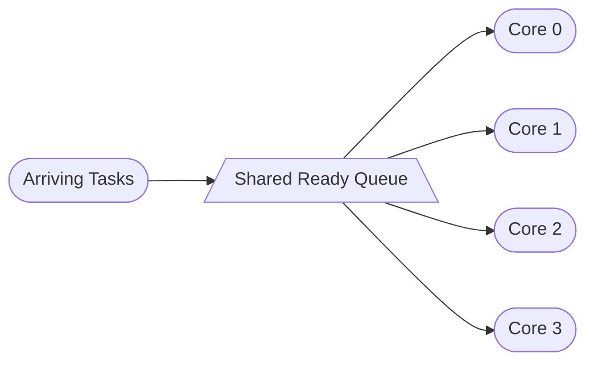
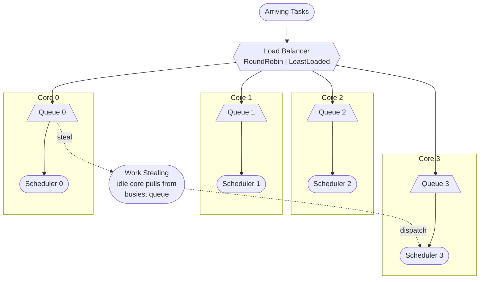
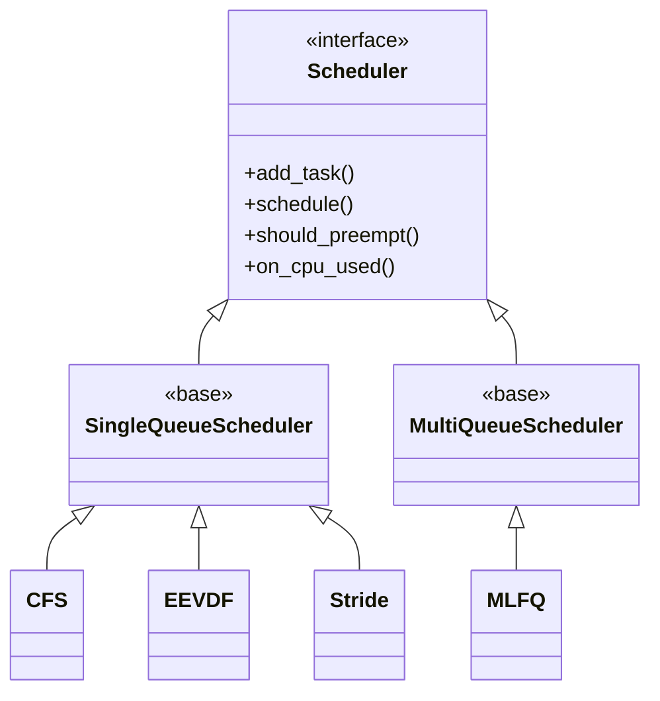

# Scheduler Simulator

A C++17 discrete-event simulator for evaluating CPU scheduling policies across single-core and multi-core configurations, including real-world trace replay.

## Features

- **4 Schedulers**: CFS, EEVDF, MLFQ, Stride
- **4 Workloads**: Server, Desktop, Google Borg V3 trace, Alibaba Cluster V2018 trace
- **3 Topologies**: SQSS, SQMS, MQMS (see diagrams below)
- **Load balancers** (MQMS): Round-Robin, Least-Loaded
- **Work stealing**: Idle cores steal from busiest queue (MQMS only)
- **Metrics**: Response time (mean, P95, P99), turnaround, throughput, Jain's fairness, context switches, preemptions
- **Run tracking**: Results saved to `runs/` with CLI parameters encoded in the filename

---

## Topology Diagrams

### Option 1 — SQSS: Single-Queue Single-Server (`-c 1 -m sq`)


One queue, one core. Simplest baseline. All schedulers run in pure single-core mode.

---

### Option 2 — SQMS: Single-Queue Multi-Server (`-c N -m sq`)



One shared queue across all cores. Cores pull the next task whenever they go idle. Higher throughput than SQSS but queue access becomes a contention point at scale.

---

### Option 3 — MQMS: Multi-Queue Multi-Server (`-c N -m mq`)



Each core has its own independent scheduler queue. A load balancer assigns arriving tasks to a core at arrival. If a core goes idle, it steals from the busiest core's queue.

---

## Scheduler Hierarchy



| Scheduler | Strategy | Key Property |
|-----------|----------|--------------|
| CFS | vruntime-based, red-black tree | Equal CPU share over time |
| EEVDF | Earliest Eligible Virtual Deadline First | Deadline-aware fairness |
| MLFQ | Multi-level feedback queue | Adapts to task behavior |
| Stride | Proportional-share via stride counters | Deterministic fairness |

---

## Build

```bash
make clean && make
```

Or with CMake:

```bash
cmake -B cmake-build -S . && cmake --build cmake-build
```

---

## Usage

```bash
# Run all schedulers on all workloads (SQSS, 1 core, 100 tasks)
./cmake-build/bin/scheduler_sim

# SQMS: shared queue, 4 cores
./cmake-build/bin/scheduler_sim -n 500 -c 4 -m sq

# MQMS: per-core queues, least-loaded balancer (default), work stealing on
./cmake-build/bin/scheduler_sim -n 500 -c 4 -m mq

# MQMS: round-robin balancer
./cmake-build/bin/scheduler_sim -n 500 -c 4 -m mq -b rr

# MQMS: disable work stealing
./cmake-build/bin/scheduler_sim -n 500 -c 4 -m mq --no-steal

# Specific scheduler and workload
./cmake-build/bin/scheduler_sim -s cfs -w server

# Google Borg V3 trace (requires CSV — see below)
./cmake-build/bin/scheduler_sim -w google -n 1000 -c 4

# Alibaba V2018 trace (requires CSV — see below)
./cmake-build/bin/scheduler_sim -w alibaba -n 1000 -c 4

# Multiple replications
./cmake-build/bin/scheduler_sim -n 100 -c 4 -r 5
```

### Options

| Flag | Description | Default |
|------|-------------|---------|
| `-n <num>` | Number of tasks per workload | 100 |
| `-c <num>` | Number of CPU cores | 1 |
| `-r <num>` | Number of replications | 1 |
| `-t <time>` | Simulation stop time (ms) | 10000.0 |
| `-s <name>` | Scheduler: `cfs`, `eevdf`, `mlfq`, `stride`, `all` | all |
| `-w <name>` | Workload: `server`, `desktop`, `google`, `alibaba`, `all` | all |
| `-m <name>` | Topology: `sq` (single-queue), `mq` (multi-queue) | sq |
| `-b <name>` | Load balancer (mq only): `rr`, `leastloaded` | leastloaded |
| `--no-steal` | Disable work stealing (mq only) | — |
| `-h` | Show help | — |

---

## Testing Configurations

6 configurations are run per scheduler (24 total across all 4 schedulers):

| # | Topology | Cores | Tasks | Flag Combination |
|---|----------|-------|-------|-----------------|
| 1 | SQSS | 1 | 10,000 | `-c 1 -m sq -n 10000` |
| 2 | SQSS | 1 | 100,000 | `-c 1 -m sq -n 100000` |
| 3 | SQMS | 4 | 10,000 | `-c 4 -m sq -n 10000` |
| 4 | SQMS | 4 | 100,000 | `-c 4 -m sq -n 100000` |
| 5 | MQMS (RR) | 4 | 10,000 | `-c 4 -m mq -b rr -n 10000` |
| 6 | MQMS (RR) | 4 | 100,000 | `-c 4 -m mq -b rr -n 100000` |

Run all 6 for a single scheduler (e.g. CFS):

```bash
./cmake-build/bin/scheduler_sim -s cfs -c 1 -m sq -n 10000
./cmake-build/bin/scheduler_sim -s cfs -c 1 -m sq -n 100000
./cmake-build/bin/scheduler_sim -s cfs -c 4 -m sq -n 10000
./cmake-build/bin/scheduler_sim -s cfs -c 4 -m sq -n 100000
./cmake-build/bin/scheduler_sim -s cfs -c 4 -m mq -b rr -n 10000
./cmake-build/bin/scheduler_sim -s cfs -c 4 -m mq -b rr -n 100000
```

---

## Real-World Trace Workloads

> **The raw trace files are NOT included in this repository.** They must be downloaded separately and placed in the correct paths before running. The extraction scripts convert the raw data into the CSV format the simulator expects.

### Google Borg V3

**Step 1 — Download** the Google Cluster Data 2019 (Borg V3) instance events from:
> https://github.com/google/cluster-data/blob/master/ClusterData2019.md

The relevant files are the `instance_events` JSON shards (gzipped, ~several GB total).

**Step 2 — Extract** using the provided script:

```bash
python3 real-time-workloads/google_v3/extract_google_v3.py \
    path/to/instance_events-*.json.gz \
    -o real-time-workloads/google_v3/google_v3_workload.csv \
    -n 50000
```

Optional flags:
- `-n <num>` — limit to N complete tasks
- `-t <seconds>` — only include tasks submitted in the first T seconds

**Step 3 — Run:**

```bash
./cmake-build/bin/scheduler_sim -w google -n 1000 -c 4
```

Expected CSV location: `real-time-workloads/google_v3/google_v3_workload.csv`
Expected columns: `arrival_time_us`, `cpu_burst_duration_us`, `nice`

---

### Alibaba Cluster Trace V2018

**Step 1 — Download** the Alibaba Cluster Trace v2018 batch instance data from:
> https://github.com/alibaba/clusterdata/tree/master/cluster-trace-v2018

The relevant file is `batch_instance.tar.gz`.

**Step 2 — Generate subset** using the provided script:

```bash
python3 real-time-workloads/alibaba_v2018/make_subset.py
```

This produces: `real-time-workloads/alibaba_v2018/batch_instance_subset_head_40000_with_header.csv`

**Step 3 — Run:**

```bash
./cmake-build/bin/scheduler_sim -w alibaba -n 1000 -c 4
```

Expected columns: `task_type`, `status`, `start_time`, `end_time`

---

Both traces are normalized to `t=0` at simulation start and times are converted to milliseconds.

---

## Results

Results are saved to `runs/` with parameters encoded in the filename:

```
runs/n100_c4_s-all_w-all_r1_m-sq.csv
runs/n10000_c4_s-cfs_w-server_r1_m-mq_b-rr_steal-on.csv
```

Each CSV row contains:

```
Scheduler, Workload, Completed, MeanRT, P95RT, P99RT, MeanTAT, MeanWT,
Throughput, JainsFairness, ContextSwitches, Preemptions
```

---

## Project Structure

```
include/
  scheduler/              Core framework
    scheduler.hpp           Scheduler interface
    single_queue_scheduler.hpp  Base for CFS/EEVDF/Stride
    multi_queue_scheduler.hpp   Base for MLFQ
    simulator.hpp           SQSS/SQMS discrete-event simulator
    multi_core_simulator.hpp    MQMS per-core simulator
    load_balancer.hpp       RoundRobin and LeastLoaded balancers
    task.hpp                Task definition
    event.hpp               Event queue
    metrics.hpp             Metrics calculation
    workload.hpp            Workload interface + TraceReplayWorkload
  schedulers/             Scheduler implementations (header-only)
    cfs_scheduler.hpp
    eevdf_scheduler.hpp
    mlfq_scheduler.hpp
    stride_scheduler.hpp
src/
  core/                   Core implementation (.cpp)
  workloads/              Workload generators
    server_workload.cpp
    desktop_workload.cpp
    trace_replay_workload.cpp
apps/
  main.cpp                Experiment runner
real-time-workloads/
  google_v3/              Extraction script (raw JSON not included — download separately)
  alibaba_v2018/          Subset script (raw data not included — download separately)
lib/                      External C libraries (RNG)
runs/                     Simulation results (gitignored)
```

---

## Adding a New Scheduler

1. Create `include/schedulers/my_scheduler.hpp`
2. Extend `SingleQueueScheduler` or `MultiQueueScheduler`
3. Implement: `schedule()`, `on_cpu_used()`, `should_preempt()`
4. Register in `apps/main.cpp` scheduler list

## Adding a New Workload

1. Add class to `include/scheduler/workload.hpp` extending `WorkloadGenerator`
2. Create `src/workloads/my_workload.cpp` implementing `generate()`
3. Register in `apps/main.cpp` workload list

---

## Requirements

- C++17 compiler (GCC 7+, Clang 5+)
- Make or CMake 3.14+
- Python 3.7+ (only needed for trace extraction scripts)

## License

MIT License
